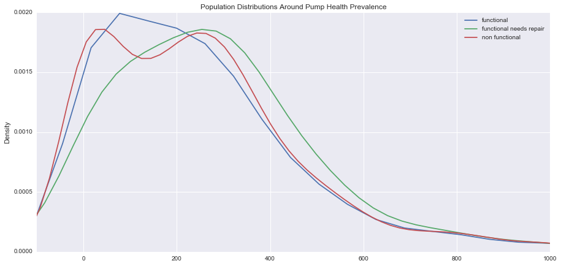
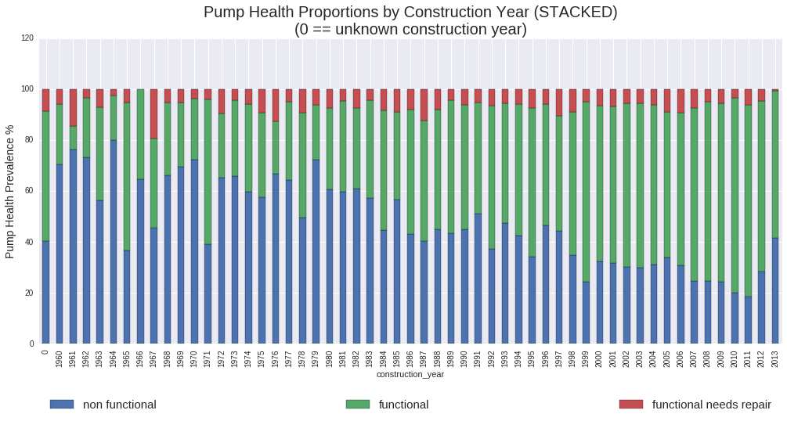
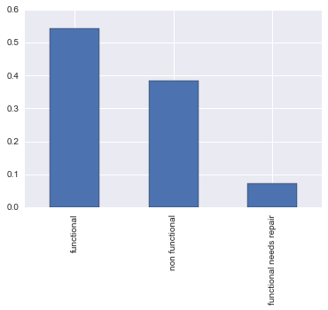

TEAM NOTE: PLEASE POST ANY USEFUL PLOT IMAGES ON SLACK BY 04/11  


# Pump It Up! Data Mining the Water Table 
A [DrivenData.org competition](https://www.drivendata.org/competitions/7/page/25/) undertaken by Metis Data Science Fellows (Spring 2016, San Francisco).  

Team __Hans'nFranz__ gonna "pump... [the water] up!":  
  
* [Ash Chakraborty](https://github.com/ashirwad08) 
* [Anthony Kim](https://github.com/ak2912)
* [Ketan Patel](https://github.com/knpatel401)
* [Jay Gondin](https://github.com/jgondin)
* [Janine Cheng](https://github.com/jcc-ne)

---  

# Baseline Model 1 - M.V.P. 
See "APPENDIX - Data Discovery Notes" for reasoning. 

```python
status_group ~ C(construction_decade) + C(quantity) + population +
    gps_height + C(basin) + C(district_codes) + C(scheme_management) +
    C(extraction_type_group) + C(water_quality) + C(quantity) +
    C(water_quality*source?) + C(extraction_type_group * waterpoint_type?) 
```  

# Exploratory Findings  
Outcome 

## Key Predictors  
On an initial pass, and without an impute strategy for missing values (of which there are quite a few) we see the following relationships between numerics, discretes, and time type predictors that offer some clues as to their candidacy in the initial baseline model.  
  
  
### Numeric Predictors  
There are 3 purely numeric predictors (not factoring in location variables). There are quite a few missing values amongst our numerics: Specifically, 
|Numeric Variable | % Missing Values |
|-----------------|------------------|
| *amount_tsh     | 70               |
| *num_private    | 98.7             |
| *population     | 30               |  

We impute the population with the mean of its neighboring regions (subvillages, ward, lga, region_code).  We see that population informs pump health slightly (or perhaps it's reverse causal): as population goes up (values get sparse beyond a 1000 so it's hard to tell) "non functional" and "functional needs repair" class distribution go up somewhat.  

  

* Choosing not to investigate *amount_tsh* for right now.  Too many missing values. 
* *num_private* has extremely sparse values; there is no description and it's difficult to impute without more domain knowledge. Choosing to exclude from his model.  

#### Datetime Predictors  

We're dealing with 2 potential predictors here: *recorded_date* and *construction_year*. Construction year seems to be a healthy predictor of pump health status. The graph below shows, not surprisingly, that older pumps breakdown a lot more than the newer ones. There is also the '0' group which grouped missing construction year.  Pumps needing repair are more or less evenly spread out by age of pump. This facts suggest either that newer pumps breakdown less, or that maintenance is better lately, or both.  




WORK IN PROGRESS......   


## Data Cleaning Steps
* __Skip__ over/undersampling to account for under-represented "functional needs repair" class.  Probably don't need this.     
* ~~Remove~~ one data point with recorded_date == 2002. __Probably don't need this if not using year recorded as a predictor__.  
  * __Impute__ Treat as numeric since it is a healthy predictor. Maybe impute based on mean construction year of sub-region.  
* __Skip__ imputing or using *amount_tsh*. Banking on _quantity_ with the assumption that it groups available water to pump.  
* __Impute__ _population_! We want to use it in our model as a potential predictor (how much a pump is used might be a predictor of health). Suggested strategy is to impute using median population of geographic neighbors. Another strategy: is to get external source of data for population by region code or something similar. Maybe it is meaningful for population to be 0??  
* __Impute__ *gps_height* == 0 are probably faulty readings! Look at gps_height cummulative proportion stack.    
* __Skip__ Lat, Long  for first run. These have information, but will we be better off just using "basin" and "region_codes" for MVP? Investigate multicolinearity with region_codes.    
* __Dummy__ _basin_. Use in model.  
* __Dummy__ *district_code*. Use in model instead of *region_code*. Look into correspondence between district codes, region codes, regions.    
* __Skip__ bucketing top 20 *funder*s.  
* __Dummy__ *scheme_management*. Use in model. Validate against *management* for similarity.    
* __Dummy__ *extraction_type_group*. Use in model.  
* __Investigate__ if *managment* is same as *scheme_management* using Chi-Squared Test for Ind.  
* __Dummy__ *water_quality*. Use in model.  
* __Dummy__ *quantity*. Use in model.  
* __Investigate__ *source* to see if it has either an interaction effect with *water_quality* or if it is multicollinear with it. Include in model only if former.  
* __Investigate__ *waterpoint_type* for interaction or multicollinearity with *extraction_type_group*; include only if former as interaction.  
* __Investigate__ *gps_height* interaction with *waterpoint_type*  


# APPENDIX - Data Discovery Notes  
  

[iPython Notebook with investigations](./data_discovery.ipynb)

## Data Discovery
Overall, 59,400 Observations and 41 Features. Attempt to predict the operational status of water pumps in [Tanzania](https://en.wikipedia.org/wiki/Tanzania).    


### Outcome Variable 

*status_group*, has 3 classes:     

* functional (~55%)   
* non functional (~37%)   
* functional needs repair (~7% imbalanced!)    
    * need oversampling/undersampling strategy    

  

### Temporal Variables
* _date_recorded_: The date the row was entered
    * (extract new feature) year:
        * 2004 and 2002 readings constitute < 1% of total dataset
        * no clear trends with year and pump health prevalence
        * After checking the outcome group proportion by year data recorded, 2002 is skewing the proportions. __Suggest remove record with date_recorded year == 2002__.
* _construction_year_: Year the waterpoint was constructed
    * some indication of functional vs. non-functional. not so much for "functional needs repair" class.
    * construction age suggests that older pumps go “non functional” more than newer ones
    * about 35% of the dataset is missing construction year. The pump health’s prevalence in these data points is pretty representative of the samples observed in other years, so we can’t discard these data points. 

### Continuous Variables
* *amount_tsh*: Total static head (amount water available to waterpoint)
    * About 70% “0” readings, but these do __not__ predict pump health outcome. It seems like these are “missing” readings.
    * Values very right skewed for dominant outcome classes
    * More _amount_tsh_ data points available for “functional” pumps
    * Might need an impute strategy here to populate by geographic location (assumption being that the amount of water available to a pump node should be more or less similar to water available to pumps that are close to it)
* _num_private_: no description available but it has numeric values (doesn’t seem categorical)
    * extremely sparse. 98.7% missing
    * values are very, very right skewed, for both dominant outcome classes
* _population_: Population around the well
    * 36% population values are either missing or true indicators (== 0). Since it wouldn’t make sense for a water pump to be in a non-populated area, we assume 36% of population readings are missing. Again, must figure out an impute strategy possibly driven by populations in close geographic locations.
    *  most “functional need repair” data points occur in lower population areas; higher population seems somewhat correlated to more functioning pumps

#### Location Specific Indicators (Numeric or Categorical)
* _gps_height_: Altitude of the well
    * assuming “0” is ground level and not missing!
    * more wells at lower altitudes but can’t really tell if gps_height discerns well between classes  
* Latitude, Longitude, V gps_height, 3D plot confirms that there are more _"non functional"_ pumps at ground level and in higher altitudes to the South, and _"functional need repair"_ pumps at higher North-Western altitudes.  
    * _Location_ (lat, long) might serve as a useful predictor. Use decimal formats. 
    * *gps_height*, might have some predictive value too as there are seem to be less "non functional" pumps but more repairs at higher altitudes... at least visually.  
* _basin_: Geographic water basin  
     * 9 basins showing a healthy prevalence of pump health status. Might serve as a useful predictor. 
     * Might help to take a closer look at pump health at lat-long by gps height, segmented by basiins to get a better idea of how much gps height is a factor.  
* *sub-village*: 
     * 19,287 uniques, too many designations
* _region_:
     * 21 regions with a good representation of pump health. Useful predictor.
* *region_code*:  
     * 27 different region codes; expanded certain regions I'm guessing (that have big cities)  
* *district_code*: 
     * 20 district codes. Probably start by considering either one of region, region_code, or district_code in initial model.  
* _lga_: Geographic location  
     * 125 uniques. Too many. 
* _ward_: Geographic location  
     * 2,092 uniques. Too many.

### Categoricals  

* _funder_: Who funded the well  
     * 1,897 uniques!
     * There are many funders but the top 20 make up about 50% of the dataset. Funders might be good predictors of pump health, but there are too many. Maybe we can consider funder groups in later, more sophisticated models.  
* _installer_: Organization that installed the well  
     * 2,145 uniques!
     * Intuition suggests that this may be a very important predictor of pump health, but there are many installers. Have to figure out some sort of a generalization strategy.  
*   *wpt_name*: Name of the waterpoint if there is one  
     * 37,400 uniques! Far too many to consider. Don't want to overfit to these anyway.  
* *public_meeting*: Boolean. No description!
     * Severely imbalanced variable with overwhelmingly "True" values. Pump health proportions for True and False classes seem to suggest no major discering power.  
* recorded_by: Group entering this row of data  
     * Only one class "GeoData Consultants Ltd". No predictive value.
* *scheme_management*: Who operates the waterpoint  
     * 12 uniques including one 'None' data point. Can see some imbalances between pump health. Could be very useful predictor.  
     *scheme_name*: Who operates the waterpoint 
          * I think "scheme_management" above is the type of "scheme" that manitains waterpoint. There are 2,696 uniques here anyway. Better of using "scheme_management".  
* _permit_: If the waterpoint is permitted
     * Most waterpoints are permitted, almost a 2:1 ratio between permitted and not. 
     * There's a fairly constant distribution of classes between these though and doesn't look like it has much discerning power. 
* *extraction_type*: The kind of extraction the waterpoint uses
     * 18 uniques; seems to be a good predictor
     * *extraction_type_group*: generalization of above
          * 13 uniques; collapses the above 
          * seems to be the healthiest predictor of the three extraction features
     * *extraction_type_class*: generlization 
          * 8 uniques; further collapses the extraction type, might lose discerning power?
* _management_: How the waterpoint is managed
     * Not sure how this is different from "scheme_management"; check for multicollinearity with "scheme_management" (chi-squared test for independence?)
     * 12 uniques (same as scheme_management)
     * *management_group*: generalization of above
         * 5 level collapse of the above
* _payment_: What the water costs   
     * 7 uniques
     * not sure how it'll affect water point health but we can try
     * *payment_type*: synomyous to _payment_ Use either one!
* *water_quality*: The quality of the water
     * 8 levels, suggest using these over ...
     * *quality_group* which generalizes only into 6 levels  
* _quantity_: The quantity of water 
     * 5 levels, good predictor. Use this instead of... 
     * *quantity_group*: synonmous!
* _source_: The source of the water
     * 10 levels of discerning power. But I suspect there's multicollinearity with *water_quality*? Investigate with chi-squared test maybe? Or even possible interaction with water quality? 
     * *source_type*: generalization into 7 levels, not very useful
     * *source_class*: generalization into 3 levels; could use this if run into memory issues with # of predictors.
* *waterpoint_type*: The kind of waterpoint
     * 7 levels 
     * *waterpoint_type_group*: 6 levels, doesn't help

---   


# APPENDIX - MISC  

## predict-water-pump-failure
* Team "Hans and Franz", competing in the [Driven Data challenge](https://www.drivendata.org/competitions/7/page/23/) 

* [see project planing/progress](https://htmlpreview.github.io/?https://raw.githubusercontent.com/https://github.com/ashirwad08/predict-water-pump-failure/master/organization/brainstorm_planing/Overview.html) 

